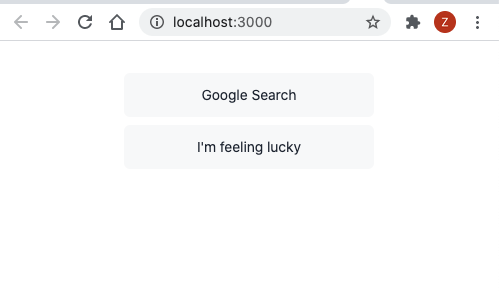

# tailwind-jit-bug (Resolved)
This is the sample repo to repro the Tailwind breakpoints not working issue on CRA project.

## Updates:

**[tailwindcss 2.1.2](https://github.com/tailwindlabs/tailwindcss/releases/tag/v2.1.2)** Fixed media-query not working issue. Big thanks to the tailwindcss community!
### Expected behavior

When turn off the `JIT` mode, the `breakpoints` works just fine. Layout fall back to `flex-col` when window size less than `640px`. See below:

## Steps to setup project

1. clone the repo and `yarn install` dependencies
2. `yarn start` to start the webpack devserver
3. Drag the browser border to make the window width less than 640px and you can see the **break points `sm` not working in the [Body component](https://github.com/wonderfulxue/tailwind-jit-bug/blob/main/src/components/Body.jsx)**

